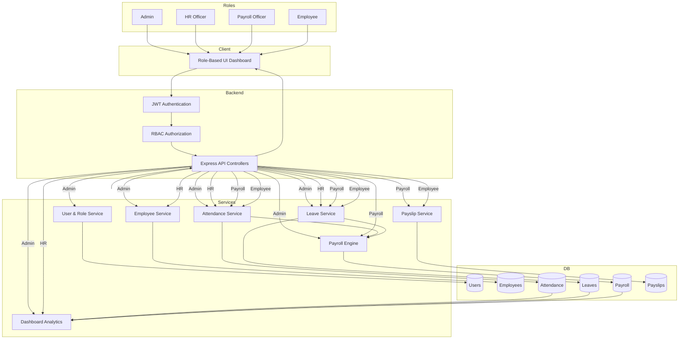

<div align="center">

# 🏢 EmPay

### Smart Human Resource Management System

> **Manage. Pay. Grow.** — End-to-end HRMS with shift-based attendance tracking, Indian payroll engine (PF, ESI, Professional Tax, Income Tax), leave workflows, PDF payslip generation, and multi-company tenant isolation.

[](https://hackathon.odoo.com/hackathon/details/18721)
[](https://expressjs.com/)
[](https://react.dev/)
[](https://www.postgresql.org/)
[](https://tailwindcss.com/)
[](https://www.docker.com/)

---

**EmPay** is a production-grade, multi-company HRMS platform built for the **Odoo x VIT Pune Hackathon 2026**. It replaces fragmented spreadsheets and manual HR processes with a unified digital system — from employee onboarding and shift-based attendance to automated payroll processing with Indian statutory compliance — all accessible through role-based dashboards for **Admins**, **HR Officers**, **Payroll Officers**, and **Employees**.

</div>

---

## 🎥 Demo

🔗 Live Demo: https://odoo.notcaliper.dev/
🔗 Live Demo Video: https://drive.google.com/file/d/1HMN1c525Xe1zaPUwd_-fkBbafEc6BowK/view?usp=sharing
---

## 🔍 The Core Problems

Traditional HR management is **broken** in most growing organizations:

| Problem | Impact |
|---------|--------|
| 📋 **Spreadsheet-based attendance** | No real-time tracking, easy to manipulate, impossible to audit at scale |
| 💰 **Manual payroll calculations** | PF, ESI, Professional Tax, Income Tax computed by hand — error-prone and slow |
| ⏳ **Paper-based leave requests** | Employees email managers, who forget to respond; no balance tracking |
| 🔓 **No role separation** | Everyone sees everything, or nothing — no structured access control |
| 🏢 **Single-company tools** | Most HR tools can't isolate data across multiple companies or branches |
| 📄 **No payslip generation** | Finance manually creates payslips in Word/Excel — inconsistent and time-consuming |
| 📊 **Zero analytics** | Management has no visibility into attendance trends, payroll costs, or attrition rates |
| 🔒 **No audit trail** | Nobody knows who approved what leave, or who ran which payroll — compliance nightmare |

> _Industry benchmarks: manual payroll processing takes **~5 days per cycle** with a **40% chance of errors** in statutory deductions (EY India Payroll Survey). HR teams spend **60% of their time** on repetitive admin tasks._

---

## ✅ What EmPay Solves

EmPay digitises and automates the **entire HR lifecycle** — from onboarding to payslip:

- **🔐 Multi-Auth System** — Login via email/password or OTP; auto-generated employee IDs (`[CompanyCode][Initials][Year][Serial]`) and crypto-secure temp passwords with forced change on first login.
- **👥 Employee Lifecycle Management** — Full profile management with department, designation, employment type, banking details, PAN, Aadhaar, emergency contacts, and manager hierarchy.
- **⏰ Shift-Based Attendance** — Configurable shifts with grace periods; automatic late/overtime calculation; holiday detection; check-in/check-out with cross-midnight support.
- **🏖️ Leave Management** — Configurable leave types (Casual, Sick, Earned, etc.) with annual quotas, carry-forward rules, balance tracking, overlap prevention, and approval workflows.
- **💰 Indian Payroll Engine** — Automated PF (12% capped at ₹15,000 basic), ESI (0.75% if gross ≤ ₹21,000), Professional Tax (Maharashtra slabs), Income Tax (New Regime FY 2024-25), pro-rated deductions for absences, and 1.5× overtime pay.
- **📄 PDF Payslip Generation** — One-click payslip generation via PDFKit with full earnings/deductions breakdown, downloadable by employees.
- **📊 Analytics & Reports** — Department breakdowns, monthly trends, headcount reports, attendance reports, leave distribution, payroll summaries, attrition analysis, and compliance reports.
- **🏢 Multi-Company Architecture** — Row-level data isolation via `company_id` on every query + PostgreSQL Row-Level Security policies for complete tenant separation.
- **📜 Immutable Audit Trail** — Every critical action (payroll runs, leave approvals, user changes) logged with old/new values, IP address, and user agent.

---

## 🛠️ Tech Stack

| Category | Technology |
|----------|------------|
| **Frontend** | React 19 · Vite 8 · JavaScript (JSX) · Tailwind CSS v3 · Lucide Icons · React Router v7 · Cal Sans + Inter (Typography) |
| **Backend** | Node.js · Express.js · JavaScript · Joi (Schema Validation) · Morgan (Logging) |
| **Database** | PostgreSQL · Raw SQL with `pg` driver · Row-Level Security (RLS) · JSONB for permissions & deductions · Views & Triggers · 60+ performance indexes |
| **Authentication** | JWT (`jsonwebtoken`) · `bcryptjs` (12 rounds) · OTP via email (6-digit, 5-min expiry, 3 attempts) · Auto-generated Login IDs & Passwords |
| **Payroll Engine** | Indian Income Tax (New Regime FY 2024-25 slabs) · PF (12%, ₹15K cap) · ESI (0.75%, ₹21K threshold) · Professional Tax (Maharashtra) · Pro-rated deductions · 1.5× overtime |
| **PDF Generation** | PDFKit — payslip PDF with full earnings/deductions breakdown |
| **Email** | Nodemailer (SMTP) — OTP delivery, credential dispatch |
| **Security** | Helmet · CORS · Role-Based Access Control (Admin / HR Officer / Payroll Officer / Employee) · Company-scoped middleware |
| **DevOps** | Docker · Docker Compose · Nginx (frontend reverse proxy) · Nodemon (dev) · Concurrently (monorepo scripts) |
| **Testing** | Python CLI test suite (`requests`) · End-to-end API validation · Interactive demo scripts |

---

## 🏗️ System Architecture

### High-Level Architecture



---

## ⭐ Key Features

### 🔐 Authentication & Access Control
- **Self-Registration** — Admin registers on the portal, atomically creating a Company + Admin user + Employee profile in a single DB transaction
- **Auto-Generated Login IDs** — Format: `[CompanyCode4][Initials4][Year4][Serial4]` (e.g., `TECHGT20260001`) — unique per company, collision-safe
- **Crypto-Secure Temp Passwords** — 12-character passwords with guaranteed uppercase, lowercase, digit, and symbol; Fisher-Yates shuffle with `crypto.randomBytes`
- **Forced Password Change** — `is_first_login` flag enforces password reset before accessing any feature
- **OTP Authentication** — 6-digit email OTP with 5-minute expiry, max 3 attempts, single-use; supports password reset flow
- **JWT Sessions** — 24-hour token expiry; payload includes `userId`, `companyId`, `roleId`
- **4-Tier RBAC** — Admin, HR Officer, Payroll Officer, Employee — each with distinct route-level and UI-level guards

### 👥 Employee Lifecycle Management
- Full profile with department, designation, employment type (Full-Time / Part-Time / Contract / Intern), and status tracking (Active / Inactive / On Leave / Terminated / Resigned)
- Banking details (account number, bank name, IFSC), PAN, Aadhaar, blood group, emergency contacts
- Manager hierarchy with `manager_id` foreign key for reporting chains
- Auto-generated `employee_code` matching the login ID
- Paginated employee directory with search and department filtering

### ⏰ Shift-Based Attendance System
- **Configurable Shifts** — Define named shifts with start/end times, grace period (0–60 min), half-day threshold, and full-day threshold
- **Smart Check-In** — Automatic late-minutes calculation after grace period; holiday detection marks attendance as `Holiday` with reason
- **Cross-Midnight Support** — Check-out resolves to the most recent unchecked-out record, even across midnight boundaries
- **Auto Status Classification** — Based on work hours: `Present`, `Half-Day`, or `Absent`; overtime calculated when check-out exceeds shift end
- **Attendance Summary** — Monthly aggregation per employee: present/absent/half-day/leave/holiday counts, total work hours, average hours, late count, overtime minutes

### 🏖️ Leave Management
- **Configurable Leave Types** — Company-specific types (Casual, Sick, Earned, Maternity, etc.) with annual quotas, paid/unpaid flag, and carry-forward rules
- **Balance Tracking** — Per-employee, per-year, per-type balances with `total_allocated`, `used`, and `balance` fields
- **Bulk Allocation** — Allocate leave balances to all active employees in one action
- **Overlap Prevention** — Leave requests validate against existing approved/pending leaves for the same date range
- **Approval Workflow** — Admin/HR/Payroll can approve or reject with rejection reasons; DB trigger automatically updates balances on approval or cancellation
- **Leave Status Lifecycle** — `Pending` → `Approved` / `Rejected` / `Cancelled`

### 💰 Indian Payroll Engine
- **Salary Structure** — Per-employee component management: Basic, HRA, Conveyance Allowance, Medical Allowance, Special Allowance, Bonus, Other Allowances; `gross_salary` auto-computed via PostgreSQL `GENERATED ALWAYS AS` column
- **Provident Fund** — 12% of Basic, capped at ₹15,000 basic ceiling
- **ESI** — 0.75% of adjusted gross if gross ≤ ₹21,000/month
- **Professional Tax** — Maharashtra slab-based: ₹0 (≤₹7,500), ₹175 (₹7,501–₹10,000), ₹200 (>₹10,000)
- **Income Tax** — New Regime FY 2024-25: 0% up to ₹3L, 5% (₹3–7L), 10% (₹7–10L), 15% (₹10–12L), 20% (₹12–15L), 30% (>₹15L) — annual computation divided by 12
- **Pro-Rated Deductions** — Per-day salary × (unpaid leave days + absent days + half-day × 0.5)
- **Overtime Pay** — 1.5× hourly rate for minutes worked beyond shift end
- **Bulk Payroll** — Process all active employees in a company in a single batch run with per-employee error isolation
- **Payroll Estimation** — Preview net salary without committing a payroll run

### 📄 PDF Payslip Generation
- **PDFKit-Powered** — Server-side PDF generation with company header, employee details, full earnings breakdown, deductions breakdown, and net salary
- **One-to-One with Payroll** — Each processed payroll record generates exactly one payslip
- **Employee Self-Service** — Employees can view and download their own payslips

### 📊 Analytics & Reporting Engine
- **Dashboard Stats** — Total employees, attendance summary, department breakdown, recent audit activity
- **7 Report Types**:
  - `department` — Headcount, attendance %, leave rate, avg salary per department
  - `monthly-trend` — Employee count, payroll cost (₹L), attendance % across 12 months
  - `leave-distribution` — Leave type breakdown with percentages
  - `headcount` — Department × designation × status matrix with new-hire counts
  - `attendance` — Per-employee: present, absent, half-day, late arrivals, avg work hours
  - `payroll` — Full earnings/deductions/net per employee for a given month
  - `compliance` — PAN verification, bank verification, PF/ESI/PT/IT per employee

### 🏢 Multi-Company Tenant Isolation
- Every table carries a `company_id` foreign key — enforced at the application layer via `companyScope` middleware
- **PostgreSQL Row-Level Security** — RLS policies on 6 critical tables (users, employee_profiles, attendance, leave_requests, payroll, salary_structure)
- **Atomic Onboarding** — Company + Admin + Employee profile created in a single transaction with rollback safety

### 📜 Immutable Audit Trail
- Every critical action writes to `audit_logs`: `action`, `entity_type`, `entity_id`, `old_values` (JSONB), `new_values` (JSONB), `ip_address`, `user_agent`
- Covers: payroll runs, leave approvals/rejections, user creation, attendance modifications
- Append-only — log entries are never updated or deleted

### 📧 Email & OTP System
- **Nodemailer SMTP** — Configurable SMTP transport for sending OTPs and welcome credentials
- **Styled HTML Emails** — Professional email templates for OTP delivery and new account credentials
- **Rate-Limited OTP** — 6-digit codes with 5-minute TTL, 3-attempt max, single-use enforcement via `otp_verifications` table

---

## 🚀 Why This Project Stands Out

Unlike typical HRMS projects, EmPay goes beyond CRUD:

- 💰 Full Indian statutory payroll engine (PF, ESI, PT, IT — not hardcoded, slab-driven)
- 🏢 Multi-company architecture with PostgreSQL Row-Level Security
- ⏰ Shift-aware attendance with grace periods, overtime, and cross-midnight handling
- 🔐 Auto-generated employee IDs and crypto-secure temporary passwords
- 📄 Server-side PDF payslip generation with PDFKit
- 📊 7 analytics reports with SQL-level aggregation (not client-side)
- 📜 Immutable audit logging for compliance readiness
- 🐳 Docker Compose deployment with Nginx reverse proxy

This transforms HR management from a spreadsheet nightmare into an intelligent, auditable system.

---

## 🚀 Quick Start Guide

### Prerequisites

| Requirement | Version |
|-------------|---------|
| Node.js | v18+ |
| npm | v9+ |
| PostgreSQL | v14+ |
| Python | v3.8+ _(for CLI test tools only)_ |

### 1. Clone & Install

```bash
git clone https://github.com/GlitchXStar/Odoo-Final.git
cd Odoo-Final

# Install all dependencies (root + backend + frontend)
npm run install:all
```

### 2. Configure Environment

```bash
cp .env.example backend/.env
```

Edit `backend/.env` with your values:

```env
# PostgreSQL
PGHOST=localhost
PGPORT=5432
PGDATABASE=empay
PGUSER=postgres
PGPASSWORD=your_password

# JWT
JWT_SECRET=your-secure-random-secret
JWT_EXPIRES_IN=24h

# Server
PORT=3000

# SMTP (for OTP & email — optional)
SMTP_HOST=smtp.example.com
SMTP_PORT=587
SMTP_USER=your@email.com
SMTP_PASS=your_smtp_password
```

### 3. Initialize Database

```bash
# Create database
psql -U postgres -c "CREATE DATABASE empay;"

# Load full schema (714 lines — tables, indexes, views, triggers, RLS)
cd backend
node upload_schema.js

# Run incremental migrations
node run_migration.js
```

### 4. Start Development Servers

```bash
# From project root — starts both backend + frontend concurrently
npm run dev
```

Or start them individually:

```bash
# Terminal 1 — Backend (http://localhost:3000)
cd backend && npm run dev

# Terminal 2 — Frontend (http://localhost:5173)
cd frontend && npm run dev
```

Once running:
- 🌐 **Frontend** → [http://localhost:5173](http://localhost:5173)
- 🔌 **API** → [http://localhost:3000/api](http://localhost:3000/api)
- 💚 **Health Check** → [http://localhost:3000/health](http://localhost:3000/health)

### 5. Docker Deployment (Optional)

```bash
docker-compose up --build
```

> Frontend served via Nginx on port 80; backend runs inside a container with `.env` file injection.

### 6. Run CLI Test Suite

```bash
cd cli
pip install -r requirements.txt
python main.py          # Interactive CLI
python check_endpoints.py  # Full endpoint validation
```

---

## 📁 Project Structure

```
Odoo-Final/
├── backend/                          # ── Express Backend ─────────────────
│   ├── server.js                     # Entry point — startup, route table, graceful shutdown
│   ├── package.json
│   ├── .env                          # Environment variables (gitignored)
│   ├── Dockerfile                    # Backend container config
│   ├── empay_hrms_schema.sql         # Full PostgreSQL DDL (714 lines)
│   ├── upload_schema.js              # Schema loader script
│   ├── run_migration.js              # Incremental migration runner
│   ├── send_mail.js                  # Standalone email test utility
│   ├── migrations/                   # SQL migration files (001–010)
│   │   ├── 001_add_login_id.sql
│   │   ├── 002_otp_verifications.sql
│   │   ├── 003_add_performance_indexes.sql
│   │   ├── 006_disable_rls.sql
│   │   └── 009_seed_default_leave_types.sql
│   └── src/
│       ├── app.js                    # Express app setup (middleware chain)
│       ├── config/
│       │   ├── db.js                 # PostgreSQL connection pool
│       │   └── constants.js          # Roles, statuses, tax slabs
│       ├── routes/
│       │   ├── index.js              # Root router — mounts 19 sub-routers
│       │   ├── auth.routes.js        # Register, login, OTP, create-user
│       │   ├── employee.routes.js    # CRUD + profile management
│       │   ├── attendance.routes.js  # Check-in, check-out, logs
│       │   ├── leave.routes.js       # Apply, approve, reject
│       │   ├── payroll.routes.js     # Run payroll, get records
│       │   ├── payslip.routes.js     # View + download PDF
│       │   ├── reports.routes.js     # 7 report types
│       │   └── ...                   # shifts, holidays, salary, dashboard, etc.
│       ├── controllers/              # 17 controllers — HTTP handlers
│       ├── services/                 # 20 services — business logic
│       │   ├── auth.service.js       # Login, register, OTP, password gen
│       │   ├── attendance.service.js # Check-in/out, shift logic, overtime
│       │   ├── payroll.service.js    # Full payroll engine (PF/ESI/PT/IT)
│       │   ├── payslip.service.js    # PDF generation via PDFKit
│       │   ├── reports.service.js    # 7 SQL-driven analytics reports
│       │   ├── email.service.js      # Nodemailer SMTP + HTML templates
│       │   └── ...                   # leave, holiday, shift, audit, etc.
│       ├── middleware/
│       │   ├── auth.middleware.js     # JWT verification
│       │   ├── role.middleware.js     # RBAC enforcement
│       │   ├── companyScope.middleware.js  # Tenant isolation
│       │   ├── validate.middleware.js      # Joi schema validation
│       │   └── errorHandler.middleware.js  # Global error handler
│       └── validations/              # 11 Joi validation schemas
│
├── frontend/                         # ── React Frontend ──────────────────
│   ├── index.html                    # Vite entry HTML
│   ├── vite.config.js                # Vite + React + API proxy config
│   ├── tailwind.config.js            # Tailwind CSS customization
│   ├── package.json
│   ├── Dockerfile                    # Frontend container (Nginx)
│   ├── nginx.conf                    # Nginx reverse proxy config
│   └── src/
│       ├── main.jsx                  # React DOM entry point
│       ├── App.jsx                   # Root component + routing (24 routes)
│       ├── index.css                 # Tailwind CSS + custom styles
│       ├── components/
│       │   ├── RoleGuard.jsx         # Route-level RBAC component
│       │   ├── DateDropdown.jsx      # Reusable month/year picker
│       │   ├── dashboard/            # Dashboard widget components
│       │   └── landing/              # Landing page components
│       ├── pages/                    # 24 page components
│       │   ├── DashboardPage.jsx     # Role-aware dashboard
│       │   ├── EmployeeDirectory.jsx # Searchable employee list
│       │   ├── EmployeeForm.jsx      # Full employee create/edit form
│       │   ├── MyAttendance.jsx      # Employee attendance view
│       │   ├── RunPayroll.jsx        # Payroll processing UI
│       │   ├── PayslipDetail.jsx     # Payslip viewer
│       │   ├── ReportsDashboard.jsx  # Analytics hub
│       │   ├── SettingsPage.jsx      # Company settings (Admin only)
│       │   └── ...                   # login, register, leaves, etc.
│       ├── layouts/
│       │   └── AppLayout.jsx         # Sidebar + nav + auth wrapper
│       ├── hooks/
│       │   └── useAuth.jsx           # Authentication state hook
│       └── services/
│           └── api.js                # Axios HTTP client + interceptors
│
├── cli/                              # ── Python CLI Tools ────────────────
│   ├── main.py                       # Interactive CLI menu
│   ├── api.py                        # API client wrapper
│   ├── utils.py                      # CLI utilities + formatters
│   ├── check_endpoints.py            # Full endpoint validation suite
│   ├── demo_employee.py              # Admin-side demo script
│   ├── demo_employee_side.py         # Employee-side demo script
│   └── requirements.txt              # Python dependencies
│
├── docker-compose.yml                # Multi-container orchestration
├── deploy.sh                         # Production deployment script
├── package.json                      # Root monorepo scripts
├── .env.example                      # Environment variable template
└── README.md
```

---

## 📡 API Reference

| Method | Endpoint | Access | Description |
|--------|----------|--------|-------------|
| POST | `/api/auth/register` | Public | Register admin + create company |
| POST | `/api/auth/login` | Public | Login with email or login_id |
| POST | `/api/auth/request-otp` | Public | Send OTP to registered email |
| POST | `/api/auth/verify-otp` | Public | Verify OTP → JWT |
| POST | `/api/auth/create-user` | Admin/HR | Create user with auto-generated creds |
| POST | `/api/auth/change-password` | Auth | Change password (forced on first login) |
| GET | `/api/employees` | Admin/HR | List all employees |
| POST | `/api/employees` | Admin/HR | Create employee profile |
| POST | `/api/attendance/check-in` | Auth | Clock in |
| POST | `/api/attendance/check-out` | Auth | Clock out |
| GET | `/api/attendance` | Auth | Get attendance logs |
| POST | `/api/leaves/apply` | Auth | Apply for leave |
| PUT | `/api/leaves/:id/approve` | Admin/HR/Payroll | Approve leave |
| PUT | `/api/leaves/:id/reject` | Admin/HR/Payroll | Reject leave |
| POST | `/api/salary-structures` | Admin/Payroll | Create salary structure |
| POST | `/api/payroll/run` | Admin/Payroll | Run payroll |
| GET | `/api/payslip/:id/download` | Auth | Download PDF payslip |
| GET | `/api/dashboard/stats` | Auth | Dashboard summary |
| GET | `/api/reports/:type` | Admin/Payroll | Generate report by type |

---

## 🔐 Auth Flow

1. **Admin** registers on the portal → `POST /api/auth/register` → atomically creates Company + Admin user + Employee profile
2. **Admin/HR** creates employees → `POST /api/auth/create-user` → auto-generated `login_id` + temp password
3. **Employee** logs in via password (`POST /api/auth/login`) or OTP (`POST /api/auth/request-otp` → `POST /api/auth/verify-otp`)
4. On first login → forced password change via `POST /api/auth/change-password`
5. All subsequent requests carry JWT in `Authorization: Bearer <token>` header

---

## 👥 Team

Built with 💻 and ☕ for the **Odoo x VIT Pune Hackathon 2026**

| Name | GitHub | Role |
|------|--------|------|
| Gaurav Tiple | [@GlitchXStar](https://github.com/GlitchXStar) | Database + Presentation |
| Akshay Manbhaw | [@notcaliper](https://github.com/notcaliper) | Backend + Docker |
| Chetan Shelar | [@lucifer0906](https://github.com/lucifer0906) | Frontend |

---

<div align="center">

**⭐ Star this repo if you found it useful!**

Made for [Odoo x VIT Pune Hackathon 2026](https://hackathon.odoo.com/hackathon/details/18721) • Built with ❤️ in India

</div>
